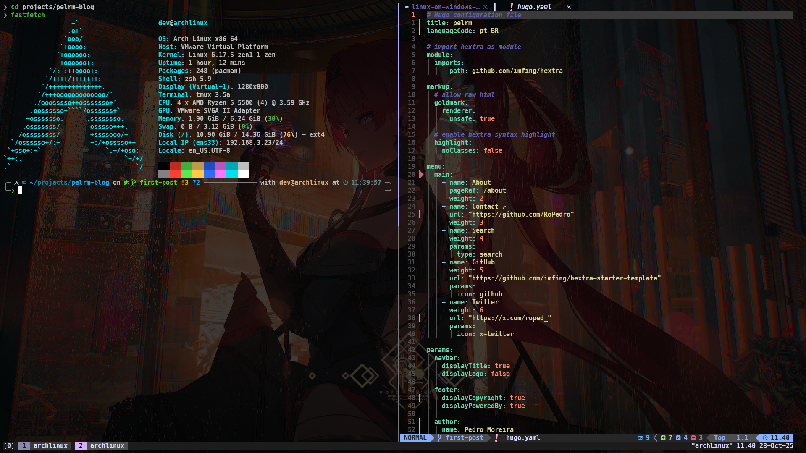

Eu já testei diversas soluções pra poder aproveitar o melhor do Linux enquanto ainda tenho acesso a um ambiente Windows completo, a primeira coisa eu tentei foi dual boot, mas isso quebrava meu sistema mais vezes do que eu tava confortável, e olha que eu sou um quebrador de sistemas profissional, o motivo é que vira e mexe, principalmente depois de updates teimosos.

Daí, assistindo o canal do [Fabio Akita](https://www.youtube.com/@Akitando), eu descobri o Windows Subsystem for Linux 2, WSL2 para os íntimos, eu segui parcialmente a configuração dele em [O Melhor Setup Dev com Arch e WSL2](https://www.youtube.com/watch?v=sjrW74Hx5Po), e pra começar a escrever códigos pra faculdade, ficar confortável com bash, me serviu muito bem. Até eu começar a brincar com Docker.

## O Dilema do Docker
O que acontece é o seguinte, Docker é uma tecnologia excepcional que eu não conseguiria viver sem, mas ele tem um tradeoff importante quando eu rodo ele várias vezes: Cada vez que você builda e roda uma nova imagem, o diretório `/var/lib/docker/...` enche, e geralmente é cache, dispensável e reconstruível, e dependendo das aplicações que você usa, enche **muito** rápido.


Tá, mas o que isso tem a ver? Não é só deletar deletar o cache periodicamente com um `docker system prune -a`? e sim, isso resolveria o problema, **mas não no WSL2**. isso porque o filesystem do WSL2 é um arquivão VHDX, que, pra o que se propõe, é bem competente, e apesar de só ser compatível com Hyper-V, isso faz ele ser bem rápido, tanto que o WSL2 roda com uma performance próxima a Linux nativa.

E qual o tradeoff? Bom, VHDX suporta crescimento dinâmico, isso significa que ele pode começar com suponha: 5gb, e ir até o máximo teórico, sem você fazer nada, mas ele **não diminui dinamicamente da mesma forma que cresce**. isso é um problema quando eu taava, por exemplo, testando um script de bash 3, 4, 5 vezes ao dia, e precisa reconstruir a imagem do zero, sem cache, e acabava enchendo o diretório do docker com 5-10gb por dia de trabalho.

O que eu fazia era, em dias mais disciplinados, desinflar o HD virtual com o comando `Optimize-VHD -Path <path\to\vhdx> -Mode Full` no PowerShell em modo administrador. Isso em teoria resolvia o problema, só que, mais de uma vez, eu deixei o VHDX crescer pra 40-60gb, quando na verdade o filesystem do Linux só tava usando uns 15-20gb. isso fez o comando demorar tanto, mas tanto, que ele simplesmente dava erro e não fazia nada no final das contas. E foi aí que eu tive que pensar em uma solução diferente, WSL2 tava fora de questão.

## Usando VMWare de Forma Inteligente
Eu já era um usuário satisfeito de VMWare Workstation a um bom tempo. Eu tenho um projeto no GitHub, que é uma série de shell scripts que configura um ambiente ubuntu pra desenvolvimento, o nome é [linuxtools-term](https://github.com/RoPedro/linuxtools-term). No dia que tô escrevendo esse texto (27/10/2025), eu não recomendo ele pra ninguém, tá feio, mal feito e precisa de atualização. mas ele não vem ao ponto, o importante é que eu usava o VMWare pra testar ambientes completos antes de lançar uma nova versão.

Daí que um dia, fuçando meu homelab, que eu configuro quase tudo por **SSH**, eu me peguei pensando "puts, imagina que legal deve ser ter um ambiente de desenvolvimento remoto num servidor que eu acesso por SSH?", a partir desse momento eu comecei a juntar as peças: **1.** Eu tenho o VMWare que consegue fazer máquinas virtuais Linux com performance relativamente boa; **2.**  Eu tenho o Windows Terminal que é um dos melhores emuladores de terminal (Perde talvez pro iTerm2); **3.** Eu tenho o VSCode, que com a extensão [Remote - SSH](https://marketplace.visualstudio.com/items?itemName=ms-vscode-remote.remote-ssh), me deixa editar código no mesmo ambiente que eu editaria Bare Metal.

Antes de mais nada, eu preciso avisar que eu **não** recomendo esse setup pra quem tem um pc fraco, e aqui eu considero PC fraco até uma CPU com 4 núcleos e 8gb de RAM. Um computador com essas especificações **não** é ruim, e perfeitamente utilizável na verdade, mas nesse ponto, eu já instalaria Linux nativamente (Gosto de [Omarchy](https://omarchy.org/) ou [Manjaro Sway](https://manjaro-sway.download/)), e não Windows, muito menos rodar VM's desse jeito. pra referência, meu pc é um [AMD Ryzen 5 5500](https://www.techpowerup.com/cpu-specs/ryzen-5-5500.c2756), 32GB de ram, e um SSD NVME de 240gb [Kingston A2000](https://www.kingston.com/datasheets/A2000_us.pdf), vulgo o mais barato que achei com um cache DRAM.

## Configurando a Máquina Virtual
Tá, finalmente sobre o setup. Com o VMWare Workstation baixado, eu crio uma VM simples e instalo [Arch Linux](https://archlinux.org/) nela, com configurações bem padrões, usando o comando `archinstall` quando a iso boota. A VM em sí eu dei 4 threads, e 6.5GB de ram, eu já tentei com 4gb, e exclusivamente pra desenvolvimento web com containers, funciona bem, mas eu aumentei um pouco porque eu tava mexendo muito com imagens de Arch Linux em Docker pra testar meus scripts. A partir daí, eu instalo Git, e rodo meu próprio script de configuração que baixa e ativa todos os meus dotfiles ([archdots](https://github.com/RoPedro/archdots/)), se não conhece o conceito, são vários arquivos que começam com . que contém as configurações de diversos softwares em Linux, como por exemplo, os atalhos de um editor de texto: [Vídeo de Dotfiles do Fireship](https://youtu.be/r_MpUP6aKiQ)



E é isso, o ambiente Linux tá pronto, agora falta só configurar a integração com Windows pra parecer "nativo". Começando com a parte de redes. no VMWare, eu troco o Network Adaptar pra Bridge, em vez do default NAT. O que isso faz, basicamente, é que pro seu roteador, a VM é interpretada como um dispositivo físico, que precisa de um IP de verdade, tipo 192.168.1.5, daí eu posso, dentro do Linux, rodar `ip a` pra saber o novo IP que o roteador deu pra VM, ir nas configurações do roteador e reservar esse IP pra esse Linux, assim, em caso de reboot, o IP não vai mudar.

Com o IP fixo configurado, falta configurar o acesso via SSH. No Windows Terminal, eu crio um novo perfil chamado `arch`, e configuro ele pra sempre rodar o comando:

```bash
ssh <name>@<ip_address>
```

substituindo `name` pelo nome de usuário do Linux, e `ip_address` pelo IP da VM. É isso, agora sempre que  abrir o profile `arch` no Windows Terminal, ele vai pedir o password e eu tô dentro do Linux.


Agora falta o VSCode, nele é ainda mais fácil, só preciso confirmar que tenho a extensão [Remote - SSH](https://marketplace.visualstudio.com/items?itemName=ms-vscode-remote.remote-ssh) instalada, apertar CTRL + Shift + P, e procurar `Connect to Host`, seguir as intruções e boa.

A cereja do bolo vem agora, o VMWare (e eu não sei se os concorrentes tem essa opção), tem uma função de `Auto Start`, a gente pode escolher uma VM pra sempre iniciar junto com o PC, e como o VMWare só aloca RAM e threads conforme o necessário, o processo vai usar somente algumas centenas de megabytes (entre 200-300mb no boot dependendo do que roda por padrão no Linux). Pra ativar, como sempre, super simples: 

`File > Configure Auto Start VMs > arch > OK`

, e boa, no próximo boot, o VMWare vai abrir em background, sem a interface, e seu ambiente Linux vai tá pronto pra uso.

## Passo Final: Chaves Seguras de SSH.
Não adianta nada ter esse setup bonitinho e não poder autenticar com repositórios privados de GitHub, pra isso precisamos das nossas chaves de SSH na VM também. O problema são dois: Eu não quero ter que digitar a senha toda vez que eu for usar a VM, e eu preciso conseguir autenticar com o meu GitHub, GitLab, ou outras ferramentas que autenticam com chaves SSH.
Considerando que as minhas chaves estão no diretório padrão do Windows (`%USERPROFILE%/.ssh`), eu posso fazer o seguinte:

```bash
ssh-copy-id -i %USERPROFILE%\.ssh.id_ed25519.pub <user>@<ip_address>
```

Isso é suficiente pra mim poder logar na na VM sem precisar digitar a senha, mas pra ter minha chave privada, precisamos de uma transferência encriptada, o mais fácil é:

```bash
scp %USERPROFILE%\.ssh\id_ed25519* user@new-machine:~/.ssh/
```

daí a gente muda as permissões:

```bash
chmod 700 ~/.ssh # 700 = Acesso completo somente pro owner
chmod 600 ~/.ssh/id_ed25519 # 600 = Leitura e escrita somente pro owner
chmod 644 ~/.ssh/id_ed25519.pub # 644 = Leitura e escrita pro owner, leitura pra todo resto
```

Finalmente, a única coisa que falta é de fato desabilitar password authentication, então eu mudo/adiciono o seguinte em `/etc/ssh/sshd_config`

```
PasswordAuthentication no
ChallengeResponseAuthentication no # desabilita qualquer desafio além de senhas
UsePAM no

PubkeyAuthentication yes
AuthorizedKeysFile .ssh/authorized_keys # Já é o default se não me engano
```
## Acabou.
Depois desses passos, eu tenho o seguinte:
1. Um Linux bootando junto com o Windows, consumindo pouco recurso;
2. Um ambiente completamente configurado e pronto pra clonar os repos e codar;
3. Uma virtual machine com IP real na rede, que, desde que eu transfira minhas chaves SSH, qualquer outra máquina minha pode acessar;
4. Um profile de Windows Terminal que automaticamente conecta de forma segura no Linux;
5. Um VSCode completo, que também conecta no Linux automaticamente.

Tudo isso por conta do problema chato de como o Docker interage com o arquivo VHDX, mas acho que valeu a pena. meu ambiente é completamente descartável, agnóstico de sistema operacional, visto que todo OS tem um bom virtualizador (VMWare, QEMU, Parallels...), e com uma performance satisfatória.

***Return to Shadow now***.
