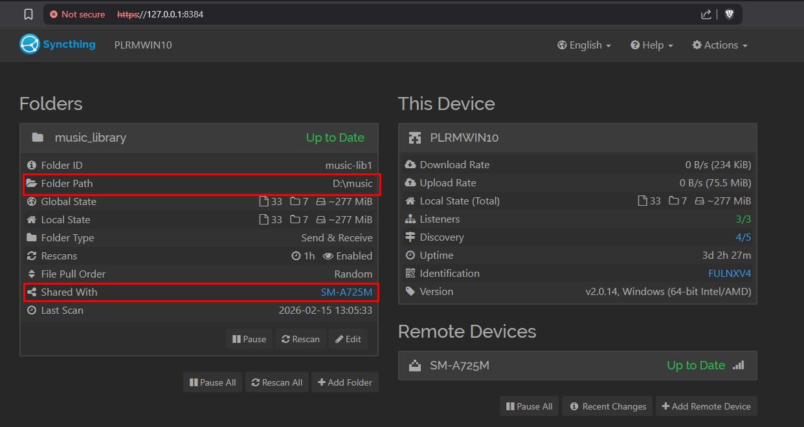
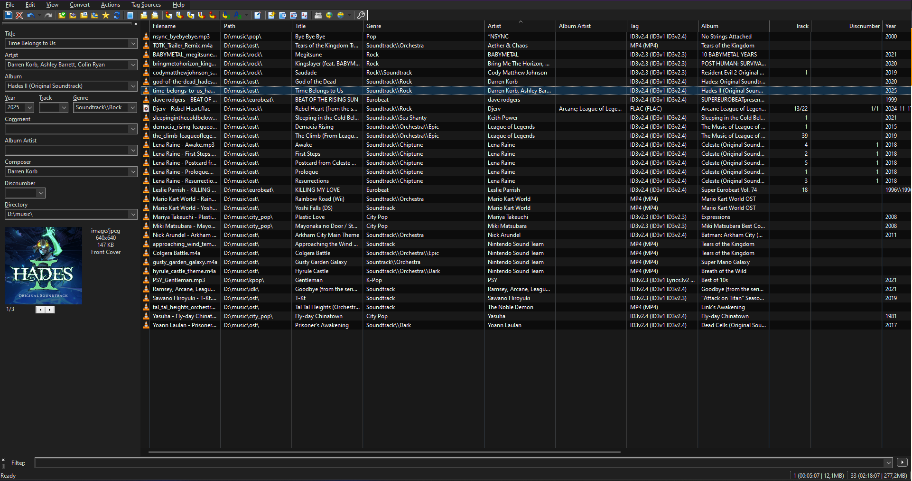
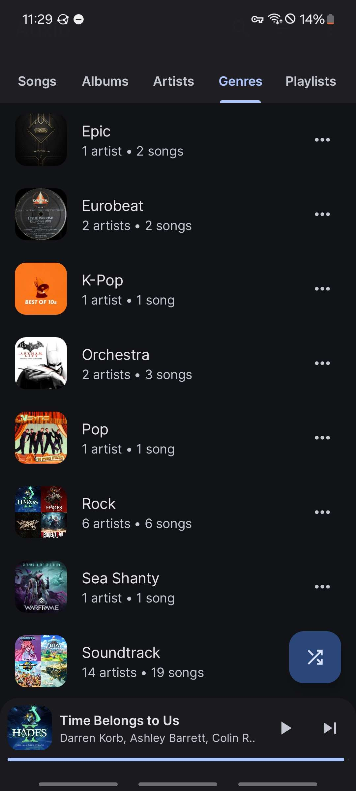

De uns anos pra cá eu me peguei escutando mais soundtracks de jogos do que músicas "normais" por falta de uma palavra melhor. E apesar de me considerar relativamente eclético em termos de gêneros mainstream, eu tenho tido costume de escutar uma quantidade pequena de músicas. Qualidade, contexto e replay são basicamente meus mantras, e é completamente normal eu ficar horas escutando a mesma música de algum jogo que eu acabei de zerar.
Daí eu pensei: 

> "Quero ter essas músicas sempre disponíveis pra escutar offline, mas pagar uma mensalidade do Spotify não faz sentido porque o tipo de coisa que eu escuto nem sempre tá disponível lá".

Então eu criei uma solução inteligente, um pouco trabalhosa, mas bem recompensadora. Usando mp3tag, Syncthing, e players de música locais.

## Usando Syncthing 

[Syncthing](syncthing.net) é um sincronizador de arquivos que funciona pela rede, e tem um conceito um pouco diferente de Self-Hosting. Imagina assim: Eu tenho um PC na sala e um celular que levo de lá pra cá, e no PC, eu tenho uma pasta `musicas` que quero acessar no celular.
Eu instalo o Syncthing em ambos os dispositivos e marco a pasta `musicas` pra sinicronizar.
E o melhor, se a pasta `musicas` for atualizada (Remoção, adição ou edição de algum arquivo), todos os dispositivos veêm a mudança, se eu atualizo a pasta no PC, a do celular atualiza sozinha.

Veja que em **"Shared With"**, eu tenho um `SM-A725M`, esse é o ID do meu celular, e ele tá recebendo a pasta `D:\music`, que é onde eu guardo as minhas músicas no meu PC. O Syncthing é o coração dessa operação e que faz tudo ser mais conveniente.

## Mp3Tag pra organizar a biblioteca

Caso ainda não tenha entendido, esse Self-Hosting funciona porque eu tenho os arquivos das músicas, como conseguir esses arquivos? **Aí é com você**, se você era da época do Google Play Music (Press F), você provavelmente sabe onde arrumar.
Só que tem um problema, arquivos de multimídia (áudio e/ou vídeo) usam Tags, são essas tags que os players tipo Spotify e Google Play Music leem pra formatar bonitinho na interface, porém, quando eu adquiro uma música, nem sempre as tags tão do jeito que eu quero, pra isso eu uso o [Mp3Tag](mp3tag.de/en), ele deixa editar todas as tags do arquivo pros players lerem exatamente do jeito que eu quero:

O software não tem uma interface polida, mas é tudo muito prático depois que pega o jeito, basicamente é só adicionar a minha pasta de músicas, clicar na música, editar o que achar necessário e apertar Ctrl + S. Ele suporta editar em bulk, adicionar imagem de álbum, enfim, é muito completo.

**PRO TIP:** Eu descobri no dia que comecei a escrever esse artigo que dá pra uma música ter mais de um gênero, isso pra mim é incrível, porque todas as músicas que são soundtrack, eu marco no gênero soundtrack, mas algumas músicas (Tipo de Hades I e II) são claramente Rock, então eu posso marcar que elas são Soundtrack/Rock.
Pra fazer isso, é só ir em Genre, no mp3tag, e escrever desse jeito: `genero1\\genero2`, essas duas contra-barras serve pra mostrar que são dois gêneros diferentes, isso é porque você pode colocar gêneros com espaço se quiser, tipo: `Nu Metal`.

## O Player de música

Essa parte é a que eu diria que é à gosto do freguês. Mas é legal escolher um bom player de música, principalmente pra celular, que categorize sua biblioteca direitinho, principalmente depois de todo o trabalho no mp3tag. Aqui eu tenho algumas recomendações:

1. [Symfonium (Android)](https://symfonium.app/): Pra mim que uso Android, esse é o cara. ele custa 18 reais pra gente aqui do Brasil, mas é de longe o melhor. Polido, bem mantido, atualizações regulares, e bem customizável;
2. [Auxio (Android)](https://github.com/OxygenCobalt/Auxio): A segunda melhor opção pra Android, também bem polido, relativamente bem mantido, e completamente gratuíto e sem anúncios. Importante dizer que, como ele não tem anúncios, ele não tá na Play Store, então você vai precisar baixar por APK, leia o Github do projeto e pegue o link no F-Droid.
3. [Spotify (Multiplataforma)](https://spotify.com/): Parece meio estranho colocar o Spotify aqui, mas pra quem não sabe, ele permite escutar arquivos locais, mas o principal motivo dele tá aqui, é a falta de bons players pra iOS, a App Store é ***cara***, é pesada na taxa com os devs, e como não tem como instalar apps por fora, os devs tem pouco incentivo pra fazer esse tipo de app pra iOS.
4. [Strawberry (Windows/Linux/MacOS)](https://strawberrymusicplayer.org/): Infelizmente, o PC não foi agraciado com um bom software no estilo dos citados anteriormente. Mas o melhorzinho parece ser o Strawberry.

A partir daí, o processo é o mesmo em todos os apps, adicionar a pasta compartilhada do Syncthing, e, caso eu organizei as tags direitinho, eu vou ter uma interface bem parecida com Spotify pra escutar música.

  <video width="360px" controls preload="metadata" style="display: block; margin: 0 auto;">
    <source src="preview_auxio_player.mp4" type="video/mp4">
  </video>

	

## Problema solucionado

Agora eu tenho minha biblioteca de músicas offline, um jeito de organizar perfeitamente os arquivos, um player de música bonito, pronto pra tirar print e postar no status, com redundância básica, e de bônus aprendi um pouco sobre como containers de multimídia funcionam.

***Return to Shadow now***