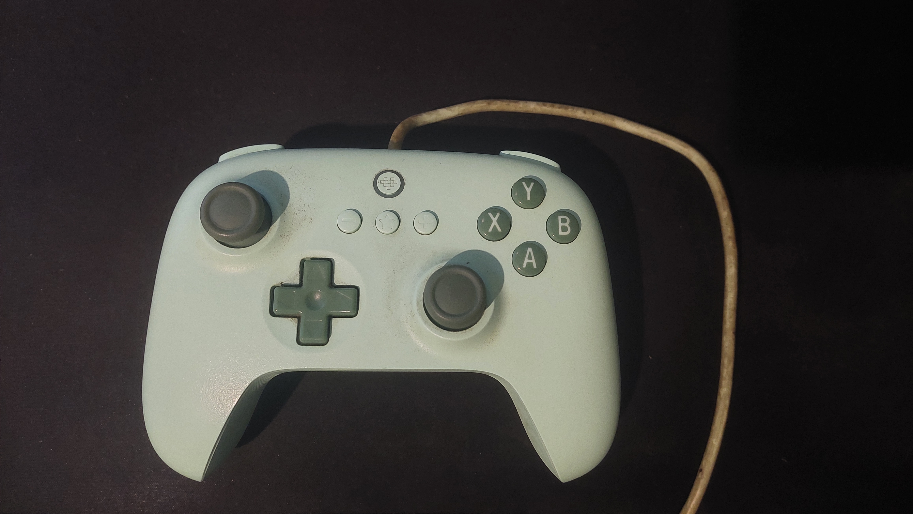
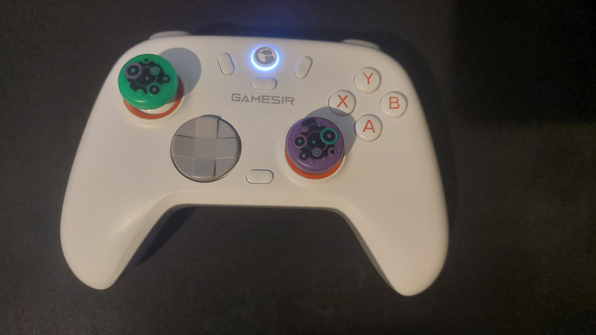
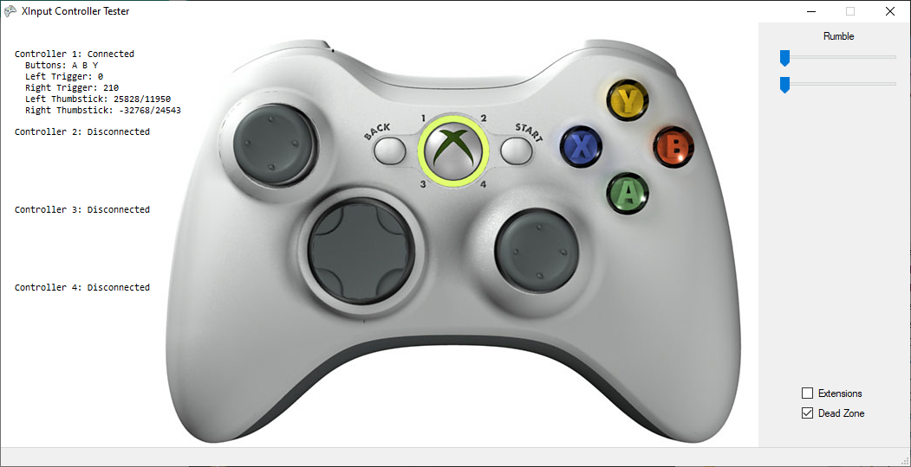

Ano passado eu queria um controle pra jogar no PC, daí eu comprei um [8BitDo Ultimate Wired C](https://www.8bitdo.com/ultimate-c-wired-controller/), ele é bem simples, basicamente, na época, era o único controle de entrada que eu conhecia. Cabo USB fixo, potenciômetros nos analógicos, botões simples, DPad medíocre (sendo bem generoso).

Enfim, pelo valor que eu paguei, tava OK, mas eu percebi que esse controle tava me dando preguiça de jogar algumas coisas porque ele não era tão confortável. A ergonomia da linha Ultimate da 8BitDo me incomoda bastante, além disso eu tava afim de um controle sem fio, então recentemente venho testando um [GameSir Nova 2 Lite](https://www.amazon.com.br/GameSir-Nova2-Lite-Nova-2/dp/B0F3D25PD3).

## Segunda tentativa: Nova 2 Lite
O GameSir é melhor em muita coisa. os analógicos são melhores (usam hall effect, não vão ter drift), o shape é mais confortável, funciona sem fio com dongle, bluetooth, no cabo, e funciona em Android, iOS, MacOS e Switch (Bem importante, já que consegui um Switch usado recentemente), e possui botões extras atrás, muito útil pra mapear coisas como L3 e R3. Mas ele também não é perfeito, e o motivo é que uma das features que eu achei que ia gostar muito nesse controle, é bem mal implementada. tô falando dos gatilhos em dois modos, que, apesar de terem um modo com atuação curta, é só uma trava de plástico que impede o movimento, e eu esperava mais.

## A redescoberta do Gyro
Eu devo ter próximo de 400-500 horas de [Splatoon](https://splatoon.nintendo.com/) no meu Wii U, e uma coisa que pra mim era novidade, era que você podia mirar mexendo o Gamepad, e nessa jornada de jogar mais usando controles, mesmo no PC, em algum momento eu queria transicionar pra jogar shooters no controle também, só que quem joga videogame a algum tempo sabe que no geral, teclado e mouse te dá bem mais controle sob a mira do que analógicos num controle, então eu fiquei pensando "Como que eu vou chegar perto da minha habilidade no teclado e mouse, jogando no controle?". A resposta é: [Controles com giroscópios](https://youtu.be/CZtKJ7qwPrY).

## Novidades em breve: Cyclone 2
Pra dar uma chance pra controle com giroscópio, eu escolhi o [GameSir Cyclone 2](https://www.amazon.com.br/GameSir-Controller-Wireless-Triggers-Charging/dp/B0DBLN822T), mesmo que atualmente a referência em girocópios seja a Nintendo e a Sony (Switch Pro Controller e DualShock 4/DualSense, respectivamente). Ainda estou esperando chegar, mas pelas análises, parece que o Gyro do Cyclone 2 é decente, além disso, esse modelo é um upgrade considerável do meu Nova 2 Lite. Ergonomia melhor, gatilhos com dual mode (Microswitch e Analógicos Hall-Effect), fora que ele é um controle bem visto até mesmo na comunidade norte americana, que é bem mais exigente que a brasileira. Provavelmente farei um post depois de experimentar o Cyclone 2.

## XInput precisa melhorar
Finalmente chegamos no título do post. O que significa o XInput melhorar? Que raios é um XInput? XInput é a "linguagem" que define como controles conversam com o Windows e os jogos, foi criada pela Microsoft, pro Xbox 360, e portada como um componente nativo do Windows e todos os produtos Xbox subsequentes. Quando você pluga um controle no PC, é ela que tá no meio dessa conversa.
Na prática, o controle fica mandando um "pacote" de dados pro PC o tempo todo: posição dos analógicos, quanto os gatilhos tão pressionados, quais botões estão apertados. O jogo lê isso via XInput e age de acordo. Na volta, o PC pode mandar sinal de vibração.
O problema é que o XInput foi desenhado pro Xbox 360, e ficou assim.

Tudo que tá nessa imagem é o que o XInput suporta, 2 gatilhos, 2 analógicos, 2 shoulders, 4 faces, start, back, xbox button, dpad, vibração. E é isso. não tem interface nativa pra gyro, ou haptics avançada como dualsense, HD rumble como no switch, nada disso.

## Meus desejos pra gamepads melhores daqui pra frente
Se você é do PC e tá disposto a fuçar configurações, a Steam já tem o Steam Input, que, desde que você emule o controle certo, você tem acesso a giroscópio. O mais normal é emular o Dualshock 4, mas você precisa de um controle que suporta isso, como os da GameSir mesmo. pra jogos de fora, adicionar ele como jogo Não Steam pode funcionar.

Isso é legal, mas melhor ainda são os jogos suportar gyro nativamente, sinceramente eu não sei quais jogos tem isso, talvez os jogos da Codemaster, tipo F1, tenham, e o Marathon, que é um jogo da Playstation Studios, e provavelmente suporta gyro no PS5. Do lado Nintendo, obviamente, tem Splatoon.

Mas realmente, no final das contas, pra coisas como Gyro, HD Humble e Haptics ficar realmente universal no PC, em jogos novos, sem gambiarra, o XInput precisa implementar isso nativamente, daí os devs tem incentivo em utilizar essas features. Minha esperança é que, com o [Project Helix](https://news.xbox.com/en-us/2026/03/11/project-helix-building-next-generation-of-xbox/), visto que vai ser um console de ***pelo menos*** 1000 dólares, a Microsoft chute o balde e lance um controle super premium, com todas essas features, e exponha pra todo mundo usar pelo XInput.

Basicamente é isso que eu quero que aconteça daqui pra frente, agora com licença porque ainda tenho muito videogame pra jogar, e só 24 horas por dia.

***Return to Shadow now***